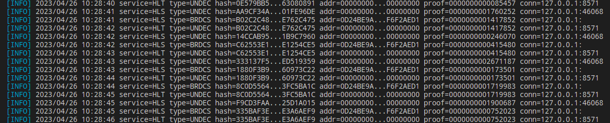

## Welcome 👋

In my free time I study cryptography, computer science and philosophy; 
I'm currently developing anonymous networks, blockchain systems and cryptographic applications; 
I work as an information systems developer and a teacher of the subject "Cryptographic means of information protection"; 

<table>
 <tr>
  <th>💬 <b>More about my projects</b></th>
  <th>🌱 <b>Main projects</b></th>
  <th>💻 <b>Programming languages</b></th>
  <th>📫 <b>How to reach me</b></th>
 </tr>
 <tr>

  <td>

  
 <b>...</b>

### Text

#### Research articles

* Theory of the structure of hidden systems: [theory_of_the_structure_of_hidden_systems.pdf](https://github.com/number571/go-peer/blob/master/docs/theory_of_the_structure_of_hidden_systems.pdf);
* Monolithic cryptographic protocol: [monolithic_cryptographic_protocol.pdf](https://github.com/number571/go-peer/blob/master/docs/monolithic_cryptographic_protocol.pdf);
* Abstract anonymous networks: [abstract_anonymous_networks.pdf](https://github.com/number571/go-peer/blob/master/docs/abstract_anonymous_networks.pdf);

#### Manuals, books

* Blockchain node programming: [blockchain.pdf](https://github.com/number571/blockchain/blob/master/_example/blockchain.pdf);
* CLI and GUI for blockchain node: [interface.pdf](https://github.com/number571/blockchain/blob/master/_example/interface.pdf);
* Cryptography and Golang: [crypto_go.pdf](https://github.com/number571/Go/blob/master/Cryptography/crypto_go.pdf);
* Cryptography with Python: [crypto_python.pdf](https://github.com/number571/Python/blob/master/Cryptography/Book/crypto_python.pdf);
* The Haskell programming language: [lazy_haskell.pdf](https://github.com/number571/Haskell/blob/master/Book/lazy_haskell.pdf);

### Applictions

#### Hidden Lake
* Hidden Lake Service: [HLS](https://github.com/number571/go-peer/tree/master/cmd/hidden_lake/service); 
* Hidden Lake Messenger: [HLM](https://github.com/number571/go-peer/tree/master/cmd/hidden_lake/messenger);
* Hidden Lake Traffic: [HLT](https://github.com/number571/go-peer/tree/master/cmd/hidden_lake/traffic);
* Hidden Lake Adapters: [HLA](https://github.com/number571/go-peer/tree/master/cmd/hidden_lake/adapters);

#### Programming language
* Another LISP Language: [allang](https://github.com/number571/allang);
* C virtual machine: [cvm](https://github.com/number571/cvm);

#### Blockhain
* Blockchain kernel with PoU: [union-bc](https://github.com/number571/union-bc);
* Cryptocurrency from scratch: [blockchain](https://github.com/number571/blockchain);
* Tendermint with GOST cryptography: [tendermint](https://github.com/number571/tendermint);

#### Deprecated!
* Hidden Lake: [hidden-lake](https://github.com/number571/hidden-lake);
* Hidden Email Service: [hes](https://github.com/number571/hes);
* P2P connections in Tor: [peer-tor-peer](https://github.com/number571/peer-tor-peer);
* Web HTML parser: [web-parser](https://github.com/number571/web-parserr);
* Schedule generator for technical College: [schedule-generator](https://github.com/number571/schedule-generator);
* Abstract assembly language: [aasm](https://github.com/number571/aasm);

### Libraries

#### Golang
* Library go-peer: [go-peer](https://github.com/number571/go-peer);
* CryptoPro for Golang language: [go-cryptopro](https://github.com/number571/go-cryptopro);

#### C and ASM
* Extended C library: [extclib](https://github.com/number571/extclib);
* Little library for assembly language: [asmlib](https://github.com/number571/asmlib);

#### Deprecated!
* Cryptography C library: [c-crypto-lib](https://github.com/number571/c-crypto-lib);
* String C library: [c-string-lib](https://github.com/number571/c-string-lib);

### Templates

* Language Go: [Go](https://github.com/number571/Go);
* Language C: [C](https://github.com/number571/C);
* Language C++: [Cpp](https://github.com/number571/Cpp);
* Language Python: [Python](https://github.com/number571/Python);
* Language Haskell: [Haskell](https://github.com/number571/Haskell);
* Language LISP: [Lisp](https://github.com/number571/Lisp);
* Language Asm: [Asm](https://github.com/number571/Asm);

  </td>
   
  <td>

  
 <b>...</b>
 
  
* [`go-peer`](https://github.com/number571/go-peer)
* [`extclib`](https://github.com/number571/extclib)
* [`cvm`](https://github.com/number571/cvm)
* [`allang`](https://github.com/number571/allang)
* [`rc-trng`](https://github.com/number571/rc-trng)

  </td>

  <td>

  
 <b>...</b>
 

* `Go` 
* `C`
* `Asm`

  </td>
  
  <td>

  
 <b>...</b>
 

* Habr: [@Number571](https://habr.com/ru/users/Number571/posts/);
* Vkontakte: [@number571](https://vk.com/number571);
* Youtube: [@CryptFunIT](https://www.youtube.com/@CryptFunIT);

  </td>
  
 </tr> 
</table>
